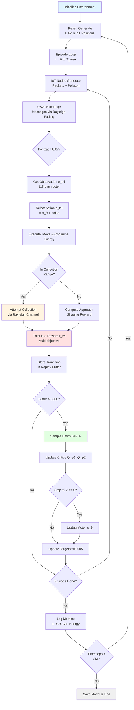

  

```mermaid

flowchart TD

A[Initialize Environment] --> B[Reset: Generate<br/>UAV & IoT Positions]

B --> C[Episode Loop<br/>t = 0 to T_max]

C --> D[IoT Nodes Generate<br/>Packets ~ Poisson]

D --> E[UAVs Exchange<br/>Messages via Rayleigh Fading]

E --> F{For Each UAV i}

F --> G[Get Observation o_t^i<br/>115-dim vector]

G --> H[Select Action a_t^i<br/>= π_θ + noise]

H --> I[Execute: Move & Consume Energy]

I --> J{In Collection<br/>Range?}

J -->|Yes| K[Attempt Collection<br/>via Rayleigh Channel]

J -->|No| L[Compute Approach<br/>Shaping Reward]

K --> M[Calculate Reward r_t^i<br/>Multi-objective]

L --> M

M --> N[Store Transition<br/>in Replay Buffer]

N --> O{Buffer > 5000?}

O -->|Yes| P[Sample Batch B=256]

O -->|No| Q{Episode Done?}

P --> R[Update Critics Q_φ1, Q_φ2]

R --> S{Step % 2 == 0?}

S -->|Yes| T[Update Actor π_θ]

S -->|No| U[Update Targets τ=0.005]

T --> U

U --> Q

Q -->|No| D

Q -->|Yes| V[Log Metrics:<br/>IL, CR, AoI, Energy]

V --> W{Timesteps <<br/>2M?}

W -->|Yes| B

W -->|No| X[Save Model & End]

  

style A fill:#e1f5ff

style K fill:#fff4e1

style M fill:#ffe1e1

style P fill:#e1ffe1

style X fill:#f0f0f0

```
